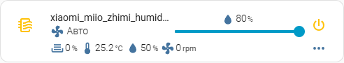
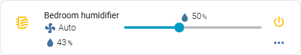
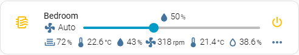

# Getting started

[Home](../README.md) | [Getting started](getting-started.md) | [Configuration](configuration.md) | [Models](models.md) | [Custom device](custom-device.md) | [Controls](controls.md) | [Indicators](indicators.md) | [Buttons](buttons.md) | [Examples](examples.md) | [AI assistants](ai-assistants.md) | [Development](development.md)

The card is one YAML block. Everything else has a default, which is what makes
it hard to know where to start: here is a path, from a card that just works to
one that is yours.

## The smallest card

A humidifier entity and nothing else:

```yaml
type: custom:mini-humidifier
entity: humidifier.xiaomi_miio_zhimi_humidifier_cb1
```

That is the whole of it. The card reads the entity's name, its humidity, and
the controls the entity exposes - an on/off button, a target-humidity slider,
and anything else in the device's own `available_modes`.



## A device, not just a domain

`model:` chooses a set of device defaults. Leave it out and the card assumes a
Xiaomi `zhimi.humidifier.cb1`. Two names cover the cases that matter most:

| `model:` | For |
|----------|-----|
| `humidifier` | any `humidifier` entity - an MQTT humidifier, a dehumidifier on a smart switch, anything Home Assistant exposes in that domain |
| `none` | no bundled defaults at all - a card that writes out every control itself |

For a generic device, set `model: humidifier`:

```yaml
type: custom:mini-humidifier
entity: humidifier.xiaomi_miio_zhimi_humidifier_cb1
model: humidifier
```

The domain preset works from what Home Assistant guarantees for that domain
and nothing else: `turn_on`, `turn_off`, `set_humidity`, `set_mode`, and the
attributes `humidity` and `available_modes`. A device the card has no preset
for starts here. See [Models](models.md) for the device presets, and
[GitHub's device list](https://github.com/artem-sedykh/mini-humidifier#supported-models)
for what is bundled.



## Making it yours

Name it, and point the read-only indicators at what you care about. Every
option has a default, but the ones below are where a card becomes a card:

```yaml
type: custom:mini-humidifier
entity: humidifier.xiaomi_miio_zhimi_humidifier_cb1
name: Bedroom
secondary_info:
  icon: mdi:fan
indicators:
  # The humidifier's own current humidity, an attribute of the entity.
  humidity:
    icon: mdi:water
    unit: '%'
    round: 0
    source:
      attribute: current_humidity
  # A room sensor beside the humidifier.
  room_temp:
    icon: mdi:thermometer-low
    unit: '°C'
    round: 1
    source:
      entity: sensor.sensor_temp_hum_pre_bedroom_temperature
  room_humidity:
    icon: mdi:water-outline
    unit: '%'
    round: 1
    source:
      entity: sensor.sensor_temp_hum_pre_bedroom_humidity
```

`secondary_info` is the line under the name - here the mode, with a fan icon.
`indicators` are the read-only values below it, **merged over the model's
defaults** (the bundled indicators stay on the card). `source: attribute` reads
from the humidifier entity itself; `source: entity` reads from any entity in
the installation. See [Indicators](indicators.md) for the full shape.



## The bottom panel

The controls - buttons and dropdowns - live in a panel hidden behind a
`...` icon. Open it always with `toggle.default`, and set the mode dropdown to
a language of your own:

```yaml
type: custom:mini-humidifier
entity: fan.xiaomi_miio_device
toggle:
  default: on
buttons:
  mode:
    source:
      auto: Auto
      silent: Quiet
      medium: Medium
      high: High
```

The bundled models come with a set of buttons (dry, mode, LED, buzzer, child
lock for the Xiaomi ones). Add or change them under `buttons: <name>:`, and a
button can act on a different entity than the humidifier itself. See
[Buttons](buttons.md).

## The action object

A tap on the card does something by default (`more-info`). Point it anywhere
with `tap_action`, a full [action object](configuration.md#action-object-options)
or the shorthand for a bare name:

```yaml
type: custom:mini-humidifier
entity: fan.xiaomi_miio_device
tap_action:
  action: call-service
  service: xiaomi_miio.fan_set_led_brightness
  service_data:
    brightness: 1
```

All the ready-made snippets are in [Examples](examples.md).

## Where the rest is

- [Configuration](configuration.md) - every card option, the action object,
  the theme variables.
- [Models](models.md) - each set of device defaults, and how to add one.
- [Custom device](custom-device.md) - a device with no preset, end to end.
- [Controls](controls.md) - target humidity, power button, toggle button,
  secondary info, group.
- [Indicators](indicators.md) - the read-only values under the entity name.
- [Buttons](buttons.md) - the bottom panel: buttons and dropdowns.
- [Examples](examples.md) - `tap_action` snippets and complete cards.
