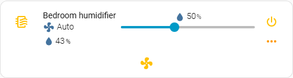
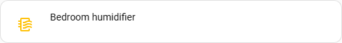
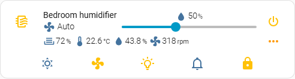
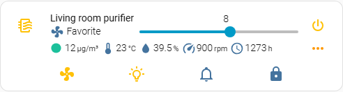
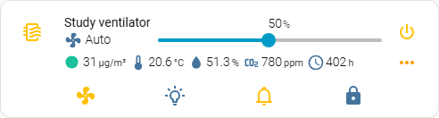
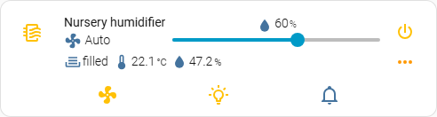

# Models

[Home](../README.md) | [Getting started](getting-started.md) | [Configuration](configuration.md) | [Models](models.md) | [Custom device](custom-device.md) | [Controls](controls.md) | [Indicators](indicators.md) | [Buttons](buttons.md) | [Examples](examples.md) | [AI assistants](ai-assistants.md) | [Development](development.md)

The card ships defaults for a number of devices. `model:` picks which set of
defaults the card starts from; anything you set in YAML is merged over them.

## Available default configurations

Each entry is the value to put in `model:`. The source file for every one of
them lives in
[src/configurations](https://github.com/artem-sedykh/mini-humidifier/tree/master/src/configurations).

Devices exposed by Home Assistant's own
[xiaomi_miio](https://www.home-assistant.io/integrations/xiaomi_miio)
integration:

| `model:` | |
|---|---|
| `humidifier` | any `humidifier` entity, built on the domain rather than on a device - see below |
| `none` | no controls at all, for a card that describes its own - see below |
| `zhimi.humidifier.cb1` | the default, used when `model:` is left out |
| `zhimi.humidifier.ca1` | |
| `zhimi.humidifier.ca4` | |
| `zhimi.airpurifier.ma2` | |
| `zhimi.airfresh.va2` | |
| `deerma.humidifier.jsq` | |
| `deerma.humidifier.jsq1` | |
| `deerma.humidifier.mjjsq` | |

The same devices through syssi's third-party
[xiaomi_miio_airpurifier](https://github.com/syssi/xiaomi_airpurifier)
integration, which reports different attributes and calls different services:

| `model:` | |
|---|---|
| `xiaomi_miio_airpurifier:zhimi.humidifier.cb1` | |
| `xiaomi_miio_airpurifier:zhimi.humidifier.ca4` | by @ravikwow |
| `xiaomi_miio_airpurifier:zhimi.airpurifier.mb3` | by @regevbr |
| `xiaomi_miio_airpurifier:zhimi.airfresh.va2` | |
| `xiaomi_miio_airpurifier:deerma.humidifier.mjjsq` | |
| `xiaomi_miio_airpurifier:deerma.humidifier.jsq5` | by @akovovh |

## What each one draws

One picture per configuration, not per `model:` - three ids share the `cb1`
file and three more share deerma's, so six copies of one card would answer
nothing. Every card below is the same entity, a Xiaomi humidifier with the
sensors and switches its integration creates beside it, with the button panel
open.

The presets in the second table are not pictured yet.

### `humidifier`

The `humidifier` domain and nothing beyond it: on/off, the target slider from
`min_humidity` and `max_humidity`, the reading from `current_humidity`, and the
modes the entity reports.



### `none`

Nothing at all - the name and the icon. Everything else is for the card to
describe itself, which is what this preset is for.



### `zhimi.humidifier.cb1`, `zhimi.humidifier.ca1`, `zhimi.humidifier.ca4`

Water level, temperature, humidity and motor speed, read from the sensors the
integration creates beside the humidifier; dry mode, the fan modes, LED
brightness, buzzer and the child lock. This is the default, so it is also what a
card with no `model:` at all draws.



### `zhimi.airpurifier.ma2`

An air purifier: the slider sets the favourite level rather than a humidity, and
the first indicator is the air quality, coloured by how bad it is.



### `zhimi.airfresh.va2`

The slider is the fan speed as a percentage, and there is a carbon dioxide
reading and the filter's hours beside the air quality.



### `deerma.humidifier.jsq`, `deerma.humidifier.jsq1`, `deerma.humidifier.mjjsq`

A simpler device: the water tank is a binary sensor rather than a level, so the
first indicator reads `filled` or `empty`, and there is no motor speed and no
child lock.



## A device that is not in the list

There are more humidifiers than this card ships configurations for, and that is
the normal case rather than a gap to apologise for. Three ways to configure one.

### `model: humidifier` - start from the domain

The preset for a plain Home Assistant humidifier: a
[generic_hygrostat](https://www.home-assistant.io/integrations/generic_hygrostat/),
an [MQTT humidifier](https://www.home-assistant.io/integrations/humidifier.mqtt/),
a dehumidifier on a smart switch, anything else that is a `humidifier` entity
and nothing more.

```yaml
type: custom:mini-humidifier
entity: humidifier.basement_dehumidifier
model: humidifier
```

That is the whole configuration. It is built on what Home Assistant guarantees
for the domain and on nothing else:

| What | Where it comes from |
|---|---|
| power | `humidifier.turn_on` / `humidifier.turn_off` |
| target humidity | the `humidity` attribute, set with `humidifier.set_humidity` |
| the slider's range | the `min_humidity` and `max_humidity` attributes |
| the reading under the name | the `current_humidity` attribute |
| modes | `available_modes`, set with `humidifier.set_mode`, disabled when the device reports none |

Anything the device has beyond the domain - a night light, a buzzer, an
external humidity sensor, a filter reading - is added in YAML on top, the same
way it would be on any other model. What this preset deliberately does not do is
guess: no LED, buzzer, child lock or water level, because those belong to
particular integrations rather than to the domain, and a preset that assumes
them calls services the device does not have.

Reach for it whenever the device is not in the table above and is a `humidifier`
entity. For a device exposed as `fan`, or one close to a bundled model, the two
options below still apply.

A card added from the dashboard picker for a `humidifier` entity starts here
already - the picker writes `model: humidifier` into the configuration it hands
you, so what it says is what the card is doing.

### `model: none` - start from nothing

The preset that brings no controls at all. Nothing is merged in, so the card
shows exactly what your YAML asks for and nothing else:

```yaml
type: custom:mini-humidifier
entity: humidifier.my_device
model: none
name: Humidifier
power:
  hide: false          # single controls start hidden - see below
  type: button
  state:
    entity: switch.my_device
  toggle_action: |
    (state, entity) => {
      const service = state === 'on' ? 'turn_off' : 'turn_on';
      return this.call_service('switch', service, { entity_id: entity.entity_id });
    }
indicators:
  humidity:
    icon: mdi:water-percent
    unit: '%'
    source:
      entity: sensor.my_humidity
```

**`power` and `target_humidity` start hidden, and want `hide: false`.** Every
other section is a collection, so an empty one is simply empty; those two are
single controls, and an empty one would be a button that does nothing when
pressed. Writing the block is not enough on its own - say `hide: false` in it.
That is the one sharp edge of starting from nothing.

`secondary_info` shows the current mode by default, read off a `mode` button. A
card with none shows nothing there rather than failing.

### Naming a device the card does not ship for

Writing a `model:` the card does not know is also **supported**, and does
something different: it starts from the *default* configuration and your YAML is
merged over it. Useful when your device is close to a bundled one and you want
to adjust rather than start over. [Issue #112](https://github.com/artem-sedykh/mini-humidifier/issues/112)
is a complete example for a `deerma.humidifier.jsq2w`, which is not in the table
above.

What that gets you is a name for your device that stays in the configuration and
reads correctly to the next person to open it. What it does not get you is any
of that device's defaults, so plan on writing out the controls you want -
`target_humidity`, `power`, `indicators`, `buttons` - rather than expecting them
to arrive.

Since 3.4.0 the card says so in the browser console when it does this:

```
mini-humidifier: 'deerma.humidifier.jsq2w' is not one of the bundled model
configurations, so the card started from the default one. That is supported ...
```

The message is there for the other half of the same behaviour: a typo. Up to
3.3.0 `zhimi.humidifier.cb11` and `zhimi.humidifier.cb1` behaved identically and
nothing said which one the card had used, and `deerma.humidifier.mjjsq` against
`xiaomi_miio_airpurifier:deerma.humidifier.mjjsq` - one device through two
integrations that call different services - is the same trap with real
consequences. The card still renders either way; the console is where you find
out which set it started from.

Leaving `model:` out asks for the default set, as it always has. `model: default`
says the same thing explicitly and warns about nothing, and so does
`model: none` - it is a preset of the card's own, not an unrecognised id.

Which of the two to reach for: `none` when you are describing the device
yourself and the bundled controls are in the way, an unrecognised name when the
default set is most of what you want.

## Adding a model

1. Copy the closest existing file in `src/configurations/<integration>/` and
   adjust it. [zhimi_humidifier_cb1.js](https://github.com/artem-sedykh/mini-humidifier/blob/master/src/configurations/xiaomi_miio/zhimi_humidifier_cb1.js)
   is the reference.
2. Register it in
   [src/humidifiers.ts](https://github.com/artem-sedykh/mini-humidifier/blob/master/src/humidifiers.ts).
3. Make sure `change_action` and `toggle_action` call services that exist in
   the integration you filed the model under. A configuration copied from
   another integration renders correctly and does nothing when clicked.
4. Add the model to the tables above.
5. Open a pull request. If you cannot write the file, open an issue with the
   entity's attributes from **Developer tools -> States** instead.

> Using the default configuration for a specific model

```yaml
type: custom:mini-humidifier
entity: fan.xiaomi_miio_device
# zhimi.humidifier.cb1 default value may be omitted, added for example.
model: 'zhimi.humidifier.cb1'
```

[deerma.humidifier.mjjsq](https://github.com/artem-sedykh/mini-humidifier/blob/master/src/configurations/xiaomi_miio_airpurifier/deerma_humidifier_mjjsq.js)
```yaml
type: custom:mini-humidifier
entity: fan.xiaomi_miio_device
model: 'xiaomi_miio_airpurifier:deerma.humidifier.mjjsq'
```
> localize status indicator
```yaml
type: custom:mini-humidifier
entity: fan.xiaomi_miio_device
model: 'deerma.humidifier.mjjsq'
indicators:
  status:
    empty: пустой
    filled: полный
```
